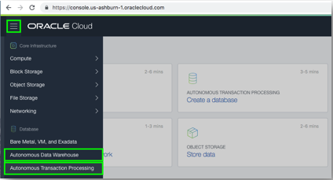
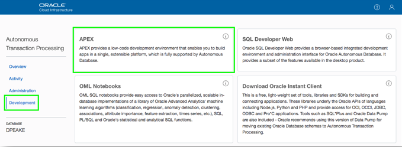
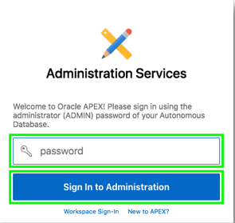
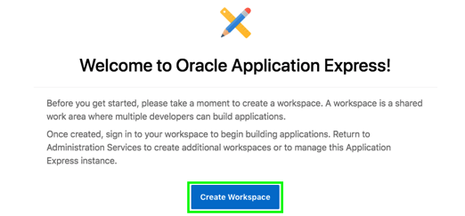
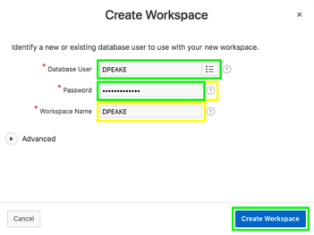
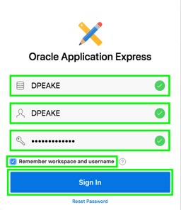
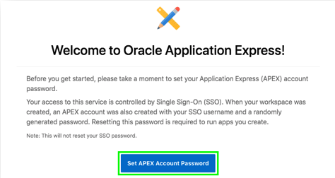
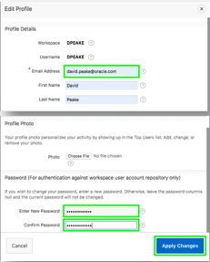

# Lab 050: Getting Started with Oracle APEX

## Introduction

When you first go into Oracle APEX you will need to log into Oracle APEX Instance Administration to create a workspace. A workspace is a logical domain where you define Oracle APEX applications. It is associated with one or more database schemas (database users) which is used to store the database objects, such as tables, views, packages, and functions, and more. These database objects are generally what you base the Oracle APEX applications on.

***To log issues***, click here to go to the [github oracle](https://github.com/oracle/learning-library/issues/new) repository issue submission form.

## Lab 050 Objectives

- Create a Workspace

## Steps

### **STEP 1:** Your Oracle Cloud Trial Account

You have already applied for and received your Oracle Cloud Trial Account.

### **STEP 2:** Log in to your OCI dashboard

- Once you receive the **Get Started Now with Oracle Cloud** Email, make note of your **Username, Password and Cloud Account Name**.

  

- From any browser go to

  [https://cloud.oracle.com/en_US/sign-in](https://cloud.oracle.com/en_US/sign-in)

- Enter your **Cloud Account Name** in the input field and click the **Next** button.

  

- Enter your **Username** and **Password** in the input fields and click **Sign In**.

  

### **STEP 3:** Create a Workspace

- Click **Administration**, and then click **APEX**.

  

- Enter the credentials for Instance Administrator and click **Sign In**.
Workspace = internal
Username = admin
Password = <APEX Password>

  
  

- Click **Create Workspace**.
  
  

- Enter your database user details:
•	Database User = <Your first initial || last name or similar>
•	Password = <Your Password>
{Note: The password must conform to Oracle Autonomous standards}
•	Workspace Name = {Will default to Database User}
  
  

- Given you have created a workspace, you need to log out of Instance Administration and log into your new workspace.
f.	Click the Account Menu (Top right of the screen)
Click **Sign Out**.
	
  

- Enter your workspace details as entered in Step d. above.
Click **Sign In**.

  

### **STEP 4:** Creating an App from a Spreadsheeet

Now that you are logged into your workspace, you can now start creating Oracle APEX applications. The application you will be building is a simple application based on a spreadsheet, however, you can also build large complex apps based on local database objects, REST enabled SQL objects, or REST APIs.

Within the Oracle APEX development environment (IDE) you will spend the majority of your time in the App Builder. In your own time you should also investigate SQL Workshop where you can create, review, and maintain database objects, Team Development where you can track large APEX development projects, and the App Gallery which contains numerous productivity and sample apps which can be installed within a few minutes. The productivity apps are self-contained, fully functional apps that you can use to meet common business requirements.

Follow the steps below to create an app based on a spreadsheet –

- Click **App Builder**, then click **Create a New App**
{Note: You can also click Create if you already have an app defined}

  

- Click **From a File**.

  

When creating an application from a file, Oracle APEX allows you to drag and drop or upload CSV, XLSX, XML, or JSON files and then build apps based on that data. Alternatively, you can also copy and paste CSV data or load sample data. 

- Within the wizard, click **Copy and Paste**.
From the sample data set list select **Project and Tasks**.

  

- Review the pasted data, and for Table Name enter **spreadsheets**
{Note: The Error Table Name is automatically populated based on the Table Name with a postfix of _ERR$ }

  

The wizard has created a new table and populated that table with the records from the sample data. Now you can create an app based on this new table.

- Click **Continue** to Create Application Wizard.

  

- Within the Create Application Wizard, for **Name** enter App from a Spreadsheet
For Features click **Check All**
Click **Create Application**

  
  

Now that the wizard has created the app, you should run the app to review what has been created.

- Click **Run Application**.

  

- On the Sign In page, enter your database username and password as entered in step 1. D. above. Click **Sign In**. 

- Click on the navigation menu options to review the report and click the edit icon on a record to display the form page. Review the charts displayed on the dashboard page, and review the options available under Administration.

  

### **STEP 5:** Improving the Report

The report you reviewed in your application is based on an Interactive Report. Interactive Reports are very powerful and allow end users to easily update the way the data is displayed. For example, end users can add filters, select columns, sort data, add computations, charts, pivots, and more.

Follow the steps below to enhance the interactive Report:

- To create a simple filter, click the **Project** column heading, and select **Bug Tracker**.

  

- To remove the filter, click the **Remove Filter ( x )** button.

  

- To add a break column, click the **Project** column heading, and select **Control Break**.

  

- To add a computational column, click **Actions**, click **Data**, and then click **Compute**.

  

- In the Computation dialog, for Column Label enter **Budget V Cost**, for Format Mask select **$5,234.10**. For Computation Expression enter **I – H** (which represents the Budget column {I} minus the Cost column {H}). Click **Apply**.

  

- To add a chart, click **Actions**, and then click **Chart**.
- In the Chart dialog, for Label select **Project**, for Value select ****Budget V Cost****.
For Function select **Sum**, for Sort select **Label – Ascending**, and for Orientation select **Horizontal**. Click **Apply**.

  

- Click the report icon in the report toolbar.

  

Interactive Reports can be saved by end users as either private reports, only they can see, or public reports that anyone can see. Developers have additional capabilities whereby they can also save a report as the primary report, which will be the default shown to every user upon displaying the report, or as an alternative report, that end users can choose to select. 

- To save the report, click **Actions**, click **Report**, and then click **Save Report**.

  

- In the Save Report dialog, for Save select **As Default Report Settings**.

  

 - In the Save Default Report dialog, for Default Report Type select **Alternative**, and for Name enter **Project Review**. Click **Apply**.

   

### **STEP 6:** Updating Columns and Items

As a developer it is often necessary to update report columns, or page items. Making such changes is quick and easy by using Page Designer, which is a comprehensive IDE for managing Oracle APEX pages. Page Designer includes left panes for selecting page components, center panes which include the layout tab which is a representation of how the page will be rendered, and the right pane for updating attributes based on the current component selected. 

Follow the steps below to update columns and item attributes:

- In the runtime environment, at the bottom of the screen, within the Developer Toolbar, select **Edit Page 2**.
{Note: The Developer Toolbar is only displayed to developers who invoke the runtime environment from the Application Builder. End Users who enter the app directly by inputting the application URL will not see the Developer Toolbar}

  

Within Page Designer, in the Rendering tree (left pane), click Columns, to expand the columns within the report. Click **Start Date**, hold down the Shift key and click **End Date**, so that both columns are selected.
In the Property Editor (right pane), For Format Mask select **12-JAN-2004**.
In the Page Designer toolbar, click  **Save and Run**.
{Note: Oracle APEX saves application definitions as metadata within the Oracle Database. As such, as soon as you save the changes, you can immediately run the application again and the updated application definition will be rendered.}

  

- The updated report will be displayed!
Click the edit icon at the beginning of one of the rows in the report.

  

The modal form page will be displayed. Currently the Status item allows any data to be entered, however, you should restrict the item so that only current statuses can be selected, using a select list. 
- To quickly navigate back to the correct page and correct item within Page Designer, you will need to utilize Quick Edit. In the Developer Toolbar, click **Quick Edit**, hover over the Status item until the item is surrounded by a blue box and a wrench is displayed in the top corner. Click the item.

 

- Within Page Designer, with P3_STATUS highlighted, in the Property Editor (right pane), for Identification > Type select **Select List**, for List of Values > Type select **SQL Query**. Click the edit icon (next to SQL Query) to bring up the Code Editor.

 

- In the Code Editor enter the following -
select distinct status d, status r
from spreadsheets
order by 1
Click **Validate**, to ensure the SQL is valid. Click **Ok**.

- Back in Page Designer, in the Property Editor, for List of Values > Display Extra Values select **No**, and for Null Display Value enter **- Select Status -**. Click **Save**.

- Navigate back to the runtime environment, refresh the browser, and click the edit icon at the beginning of one of the rows in the report.
Within the modal form page, click on the Status item.

### **STEP 7:** Adding a Calendar

As a developer it is also very easy to add additional pages. Given the spreadsheets table has start and end date columns it would be beneficial to add a calendar page and then link it to the modal page to allow updates directly from the calendar.

Follow the steps below to add a Calendar page:

- To return to the Application Builder, use the Developer Toolbar, at the bottom of the runtime window, and click **Application xxxxx**.
- In the Application Builder, click **Create Page**.

  

- In the Create a Page dialog, select **Calendar**.

  

- In the Create Page – Page Attributes dialog, for Page Name enter **Calendar**, and for Breadcrumb select **Breadcrumb**. Click **Next**.

  

- In the Create Page – Navigation Menu dialog, for Navigation Preference select **Create a new navigation menu entry**. Click **Next**.

  

- In the Create Page – Source dialog, for Table / View Name select **SPREADSHEETS (table)**. Click **Next**.

  

- In the Create Page – Settings dialog, for Display Column select **TASK_NAME**, and for End Date Column select **END_DATE**. Click **Create**.

  

To create the link between the calendar and the form page you need to update the page attributes for the calendar page you just created.
- In Page Designer, within the Rendering tree (left pane), under Calendar, click **Attributes**. In the Property Editor (right pane), for Settings > View / Edit Link click **No Link Defined**.
On the Link Builder – View / Edit Link dialog, for Page input or select **3**, for Set Items > Name select **P3_ID**, for Value select **&ID.**, and for Clear Cache enter **3**. Click **Ok**.
In Page Designer, click **Save and Run**.

  

In the Runtime environment, click on a calendar entry. The form page should appear.

  

### **STEP 8:** Adding Application Users

You have created an application for viewing and maintaining the data from the spreadsheet. However, you should also tighten the application security so that only users you specify can access the application. To implement such functionality you will need to update the access control, add a Database user, and add the user to the list of allowed users for the application.

Follow the steps below to add an application user:
- In the Runtime environment, click **Administration**, and then click **Access Control**. In the Configure Access Control dialog, click **Yes**. Click **Apply Changes**.

  

- On the Administration page, click **Users**. In the Manage User Access dialog, click **Add User**. In the user dialog, for Username enter **reader**, and for Role check **Reader**. Click **Add User**.

  

- Return to the Application Builder. In the Application Builder toolbar click **Administration** (third icon from the right), and then click **Manage Users and Groups**.

  

- Click **Create User**. In the Create User page, for Username enter **reader**, for Email Address enter **reader@email.com**, for Password and Confirm Password enter a valid password, and for Require Change of Password on First Use select **No**. Click **Create User**.
{Note: The password must conform to Oracle Autonomous standards}

  

- Return to the Runtime environment, in the navigation bar click your username, and then click **Sign Out**.

  

- Log back into the application using the reader credentials (Username = reader and Password is what you entered in Step d. above).
Navigate to the Spreadsheets page – Notice how the edit icons are no longer displayed as this users does not have contributor or administrator rights.

  

{Note: If you navigate to the Calendar and click on an entry an error message will be displayed: “Insufficient privileges, user is not a Contributor”. This is expected behavior, as you are logged on as a reader and are trying to access a page for updating records.}

To learn more about Oracle APEX go to https://apex.oracle.com

**This completes the Lab!**

**You are ready to proceed to [Lab 100](LabGuide100.md)**
