# Lab 300: Build Database Objects in Autonomous Database

## Introduction

put something here

***To log issues***, click here to go to the [github oracle](https://github.com/oracle/learning-library/issues/new) repository issue submission form.

## Lab 300 Objectives

- Create Database Objects using Quick SQL
- View and Modify Data Model
- Generate DDL
- Run DDL Script to Create Database Objects
- Run Script to Load Data into Database
- Create View

## Steps

### **STEP 1:** Create Database Objects using Quick SQL

-  Select **SQL Workshop**, then select **SQL Scripts**.

  

-  Click **Quick SQL**.

  

-  Copy the following into the left pane Quick SQL window area. Review the code and click **Generate DDL**.
<pre>
team_members /insert 10
  username /nn /upper
  full name
  email /nn
  phone_number
  profile
  photo file
projects /insert 20
  name /nn
  project_lead /nn /references team_members
  budget num
  status vc30 /nn /check ASSIGNED, IN-PROGRESS, COMPLETED
  completed_date
  description
  milestones /insert 30
    name /nn
    due_date /nn
    description
  tasks /insert 100
    name /nn
    assignee /nn /references team_members
    milestone_id /references milestones
    start_date /nn
    end_date
    cost num
    description
    is_complete_yn /check Y, N

view project_tasks projects tasks
</pre>
NOTE:put something here

  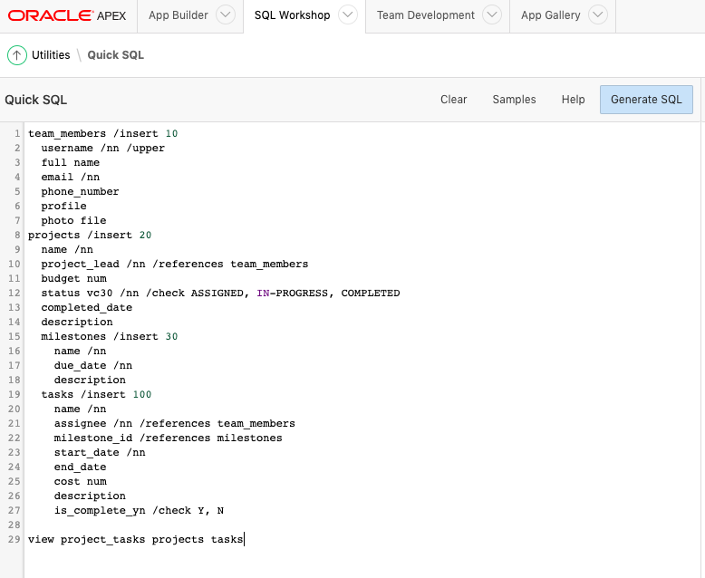

-  Note the DDL that is generated. You may want to change some of the settings, click **Settings**.

  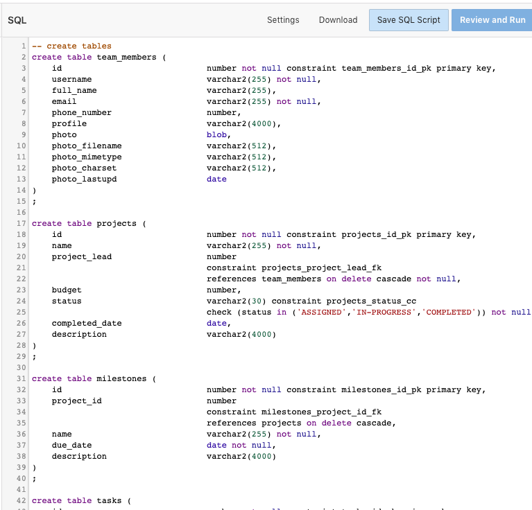

-  Change the following settings and click **Save Changes**.

Object Prefix, enter **HOL**

On Delete, select **Restrict**

Primary Keys, select **12c Identity Data Types**

Date Data Type, select **TIMESTAMP WITH LOCAL TIME ZONE**

**Audit Columns**, check Include

**Row Version Number**, check Include

  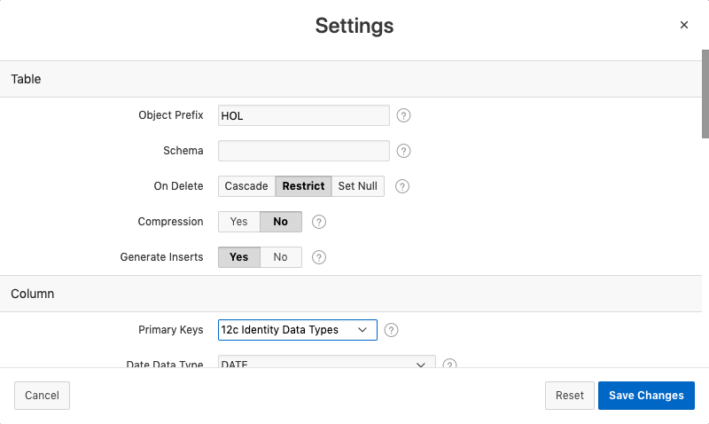

  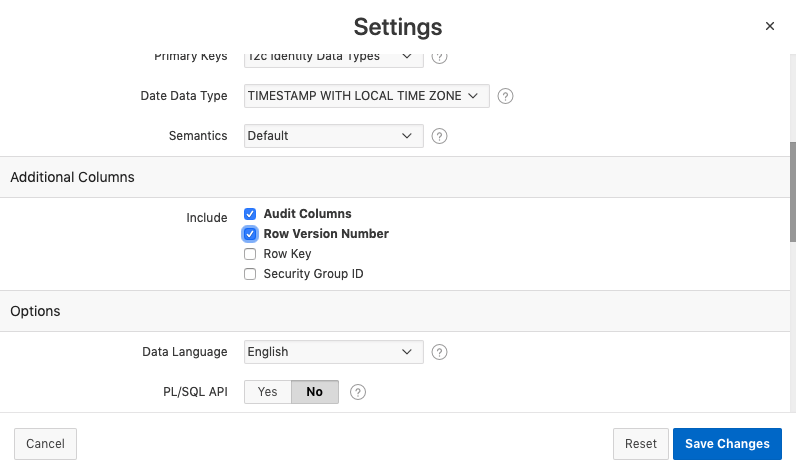

-  Click **Save SQL Script**.

  

-  Enter **HOL** for Script Name and click **Save Script**.

  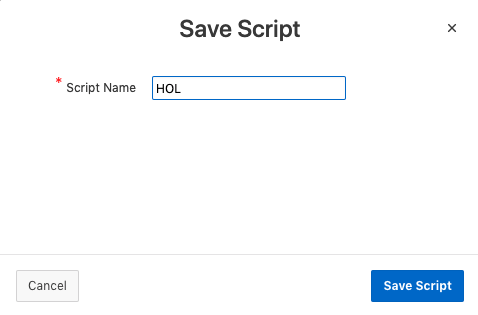

-  Click **Review and Run**.

  

-  Click **Run**.

  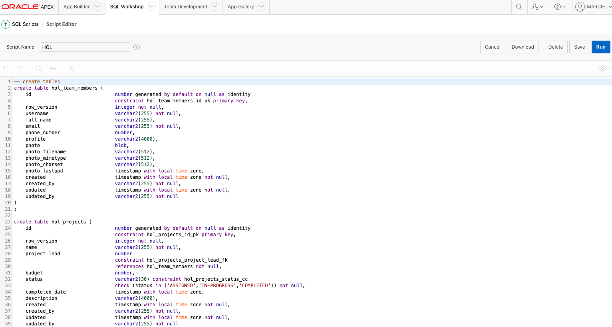

-  Click **Run Now**.

  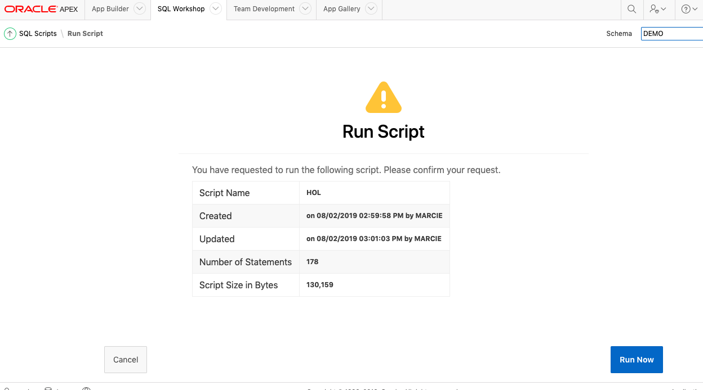

-  The script ran and you now see the log. Scroll to the bottom to see the summary

  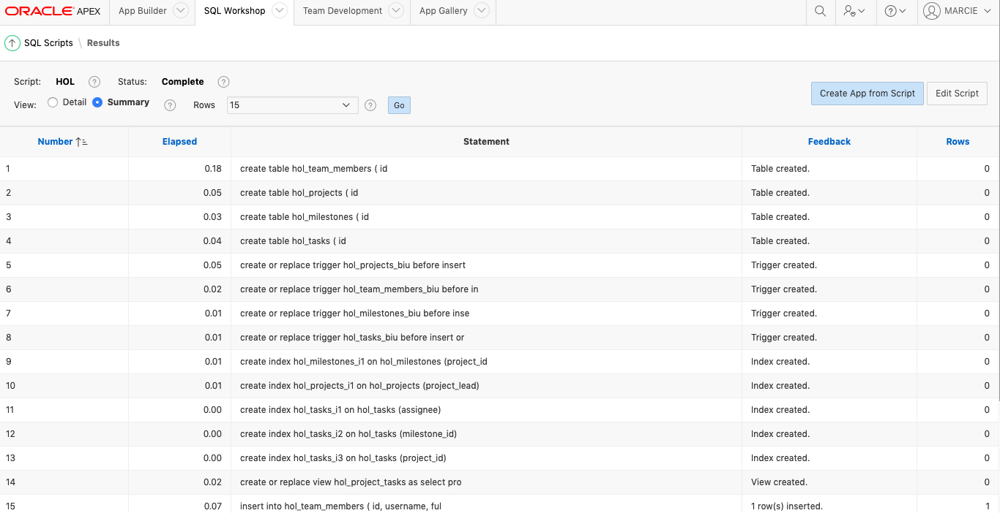

  

-  You can view the database objects that were created and vide the data that was loaded. Select **SQL Workshop** and select **Object Browser**.

  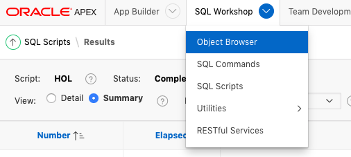

-  Search for **HOL** to see the tables you created. Select **HOL_PROJECTS**. Review the columns in the table.

  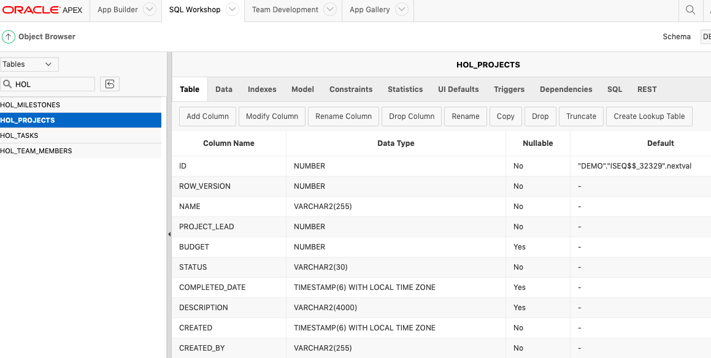

-  Click the **Data** tab to see the data that was loaded.

  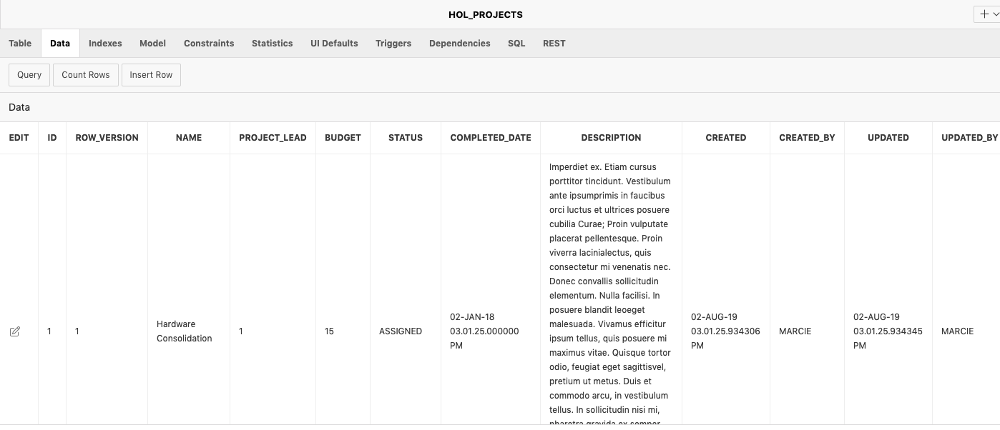

### **STEP 2:** View and Modify Data Model

In this section, you will access SQL Developer Web and review the current objects and make some modifications to the Data Model.

-  Switch to the Service Console tab in your browser. Select **SQL Developer Web**.

  

-  Log in to SQL Developer Web.

  

-  Log in to SQL Developer Web.

  
  
**This completes the Lab!**

**You are ready to proceed to [Lab 400](Lab400.md)**
